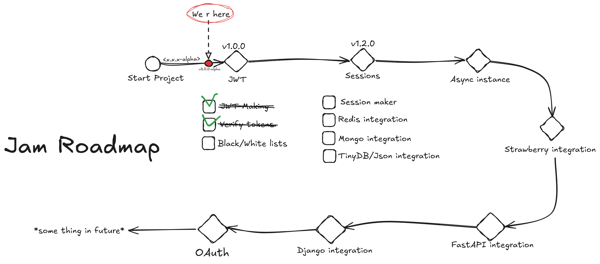

# Jam


 


> [!CAUTION]
> In active development! Cannot be used in real projects!
> 

## Install
```bash
pip install jamlib
```
or from repo:
```bash
git clone https://github.com/lyaguxafrog/jam.git && \
cd jam/ && uv sync --no-dev  # need to install uv
```

## Getting start
```python
# -*- coding: utf-8 -*-

from typing import Any

from jam import Jam
from jam.utils import make_jwt_config

config = make_jwt_config(
            alg="HS256",
            secret_key="some_secret",
            expire=18000
    )

data = {
    "user_id": 1,
    "role": "admin"
}

jam = Jam(auth_type="jwt", config=config)

payload = jam.make_payload(**data)
token = jam.gen_jwt_token(**payload)
```

## Roadmap

