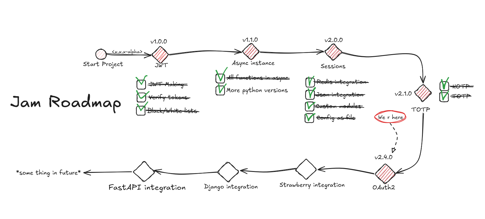

<div style="text-align: center;">
    
    <p>Welcome to Jam documentation!</p>
</div>

## About
Jam(Jeneric auth module) - This is a simple library for easy implementation
of auth* in your application!

## Installation
<!-- termynal -->
```
> pip install jamlib
---> 100%
Installed!
```

## Quick start
```python
from jam import Jam

# you can use yml ot toml files for configuration, seeL jam.makridenko.ru/config
config = {
    "auth_type": "jwt",
    "alg": "HS256",
    "secret_key": "secret",
    "expire": 2600
}

jam = Jam(config=config)
payload = jam.make_payload(**{"user_id": 1})
token = jam.gen_jwt_token(**payload)
```

## Asynchronous support
!!! note
    You can use `jam.aio` module to work with async functions. **The methods are the same**, but you need to use `await` keyword.


```python
from jam.aio import Jam

config = {
    "auth_type": "jwt"
    "alg": "HS256",
    "secret_key": "secret",
    "expire": 2600
}
jam = Jam(config=config)
payload = await jam.make_payload(**{"user_id": 1})
token = await jam.gen_jwt_token(**payload)
```

## Why Jam?
| Library                               | JWT | White/Black lists for JWT | Serverside sessions | OTP | OAuth2 | Flexible config |
|---------------------------------------|-----|---------------------------|--------------------|-----|--------|-------|
| **Jam**                               | ✅   | ✅                         | ✅                  | ✅   | ⏳      | ✅     |
| [Authx](https://authx.yezz.me/)       | ✅   |  ❌                       |  ✅                  | ❌   | ✅      | ❌     |
| [PyJWT](https://pyjwt.readthedocs.io) | ✅   | ❌                         | ❌                  | ❌   | ❌      | ❌     |
| [AuthLib](https://docs.authlib.org)   | ✅   | ❌                         | ❌                  | ❌  | ✅      | ❌     |
| [OTP Auth](https://otp.authlib.org/)  | ❌   | ❌                         | ❌                  | ✅   | ❌      | ❌     |


## Roadmap

